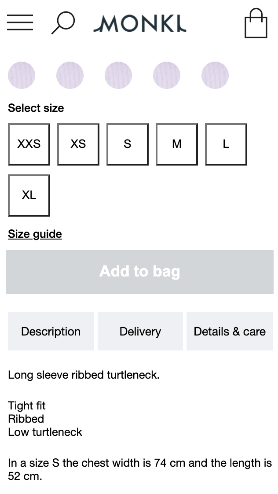
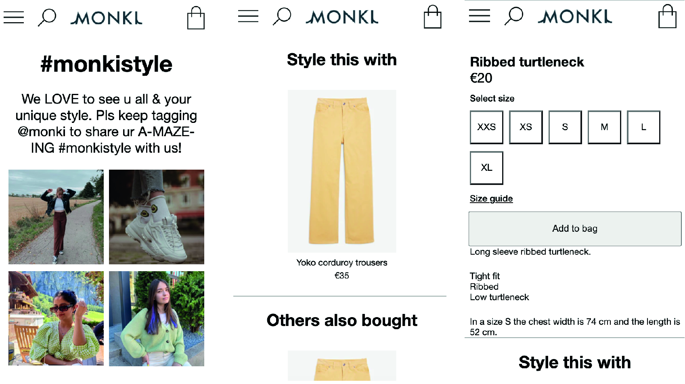
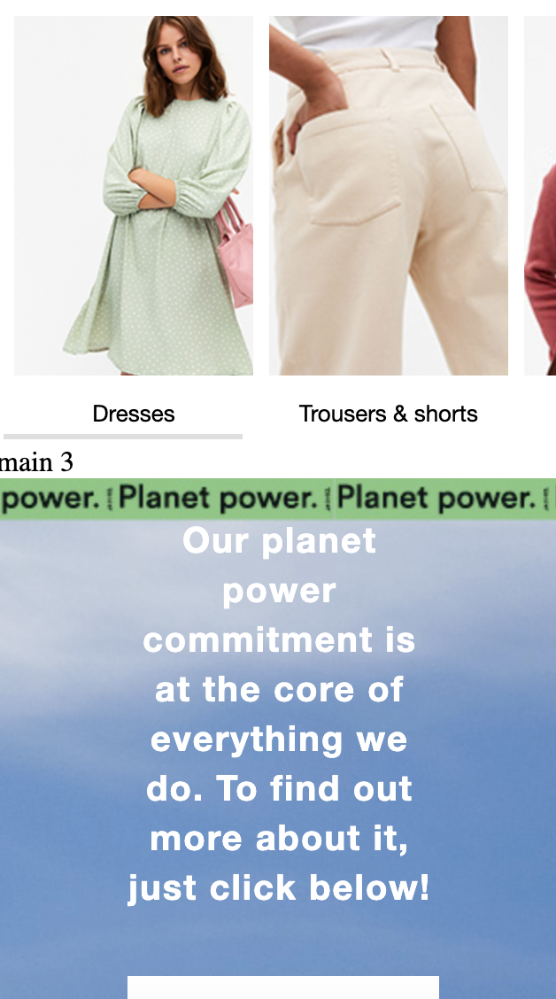
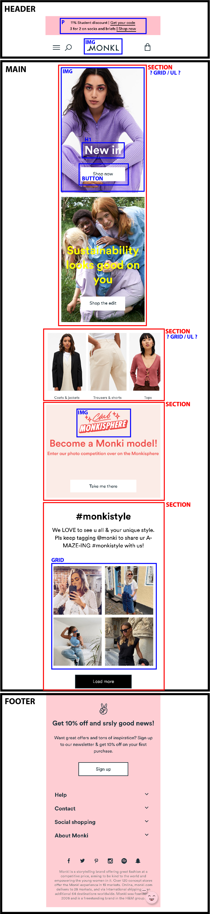

# Procesverslag
**Auteur:** Pip Mombers

Markdown cheat cheet: [Hulp bij het schrijven van Markdown](https://github.com/adam-p/markdown-here/wiki/Markdown-Cheatsheet). Nb. de standaardstructuur en de spartaanse opmaak zijn helemaal prima. Het gaat om de inhoud van je procesverslag. Besteedt de tijd voor pracht en praal aan je website.

## Bronnenlijst
1. https://www.monki.com/en_eur/index.html
2. https://www.geeksforgeeks.org/gradient-borders/
3. https://codepen.io/HowToDevCode/pen/ozbWKN?editors=0010
4. https://www.w3schools.com/jsref/tryit.asp?filename=tryjsref_element_innerhtml

## Eindgesprek (week 7/8)

-dit ging goed & dit was lastig-

**Screenshot(s):**

-screenshot(s) van je eindresultaat-

## Voortgang 3 (week 6)

### Stand van zaken

Ik heb deze week niet heel veel gedaan aan de website. Ik had mijn prioriteit even aan andere vakken gegeven. Wel heb ik nu alles in sections ingedeeld en zoveel mogelijk commentaar neergezet. 

De kleurenrondjes netjes maken is mij nu wel gelukt en ik heb al een animatie kunnen toevoegen. 

**Screenshot(s):**

### Agenda voor meeting

- 

### Verslag van meeting

Ik kan voor het description stukje naar innerhtml om de tekst te veranderen. Ik moet nu vooral de website nog responsive maken voor mobiel en wat meer animaties toevoegen. 

## Voortgang 2 (week 5)

### Stand van zaken

Ik heb het background-image probleem nu kunnen oplossen dus de knoppen zitten nu goed in het midden. De vaste navigatie bovenaan de pagina heb ik geprobeerd te veranderen maar vind het nog steeds niet goed genoeg. Ook ben ik begonnen aan de tweede pagina, tot nu toe gaat dat ook nog goed, en heb ik javascript werkend gekregen wat best wel snel goed verliep. 

Wel had ik nog wat problemen met het css bestand voor 2 verschillende pagina's gebruiken, maar dat heb ik nu kunnen oplossen met het gebruiken van id's en classes dus hoop dat dat goed is.

**Screenshot(s):**

### Agenda voor meeting

- Boven navigatie nog steeds niet helemaal goed
- Kleurenlijstje tweede pagina lukt niet
- het description stukje op de tweede pagina aanpakken
- streep door een maat

### Verslag van meeting
De studentassistent gaf aan dat ik goed bezig was en op schema zat. Daar was ik erg blij mee. Ook gaf hij aan dat ik op dit moment iets minder hoef te focussen op de exacte vormgeving en meer nu met animaties, responsive enz. bezig kan zijn. 

De kleuren/stof rondjes moet ik proberen met flexbox en het description stukje met buttons en gewone tekst (javascript, dus werkend pas als ik er tijd voor heb). 

Verder om de html nog wat netter te maken gaf die aan om wat meer sections te gebruiken zodat het beter als een 'groep' werkt, en meer comment tags toevoegen om het ook voor mijzelf wat overzichtelijker te houden. 

Nu ga ik dus aan de slag met animaties en het responsive gedeelte. 

## Voortgang 1 (week 3)

### Stand van zaken

Position: absolute en Position: relative had ik hiervoor eigenlijk nooit echt goed gebruikt, omdat ik niet goed wist wat het betekende. Dit ging nu vrijwel gelijk goed. 

Wat ik vooral nog heel lastig vind is om alles goed in het midden te positioneren en het dan ook responsive te houden. Nu heb ik een paar dingen nog gecentreerd met left en right maar zodra ik dan de schermgrootte vergroot klopt het niet meer. Sowieso het hele responsive gedeelte vind ik nog heel lastig. 

**Screenshot(s):**

### Agenda voor meeting

- Het responsive gedeelte
- Teksten en foto's goed centreren (dus horizontaal en verticaal)
- Hoe gebruik je maar 1 css bestand als je werkt met nth-of-type
- De afbeeldingen in mijn navigatiebalk goed zetten

### Verslag van meeting

Om de buttons en andere dingen beter te centreren heb ik als advies gekregen om display: flex; op de "wrapper" van de elementen te zetten en dan vervolgens justify-content: center; gebruiken om alles in het midden te kunnen zetten. En verder kan ik beter de afbeeldingen als background-image gebruiken dus daar ga ik ook naar kijken. 

De navigatie kan ik beter verdelen in groepjes. Dus de elementen die meer aan de linkerkant staan in een andere groep zetten als de elementen die aan de rechtkant staan. Zo kan ik het beter positioneren. 

Het responsive gedeelte wordt blijkbaar nog in de les besproken dus dat heb ik voor nu nog maar even gelaten. 

En verder moet ik nog gaan kijken naar waar ik Javascript wil gaan toepassen, dat was ik voor deze voortgang even vergeten ;). 

## Intake (week 1)

**Je startniveau:** Blauw

**Je focus:** Surface plane

**Je opdracht:** https://www.monki.com/en_eur/index.html

**Screenshot(s):**

 

**Breakdown-schets(en):**

